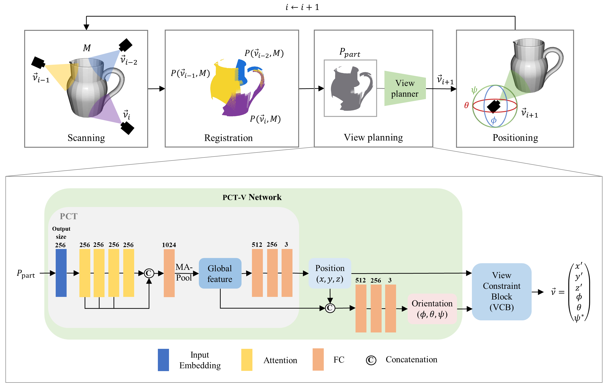

<h1 align="center">PIT-NBV</h1>
<p align="center">PIT-NBV: Poisson-Informed Transformer for 6-DOF Next Best View Planning in 3D Object Reconstruction with Narrow Field of View (IEEE TCDS 2025)</p>

<p align="center">
  
  <br/>
  <em>Overview of PIT-NBV pipeline.</em>
</p>

## Tested Environment
- Ubuntu 20.04
- Python 3.12
- CUDA 11.8, cuDNN 8.9.2
- PyTorch 2.1
- Open3D 0.18.0

## Quick Evaluation
If you only need evaluation, you can run it right away **with our pretrained weights**!
```bash
python test.py
```

## Dataset Generation
1. Download [ShapeNetCore.v1](https://www.shapenet.org/)
2. Split the dataset into train, valid, test
    ```bash
    cd supervision_dataset
    python 1_split_dataset.py
    ```
3. OBJ → PCD(Sequential cloud), CSV(NBV)
    - First, build our modified poisson-guided autoscanning code. (The code will be uploaded soon.)
    ```bash
    python 2_poisson_gen_nbv_data.py
    ```
4. PCD(Sequential cloud), CSV(NBV) → HDF5(h5py)
    ```bash
    python 3_poisson_dataset_h5py.py
    ```

## Training and Evaluation
* Dataloader : `dataloader_poisson.py`
* **Train**
    ```bash
    python train.py
    ```
* **Test**
    ```bash
    python test.py
    ```

## Citation

If you use our codes, please cite our paper ([IEEE Xplore](https://doi.org/10.1109/TCDS.2025.3606221)).

```bibtex
@article{lim2025pit,
  title={PIT-NBV: Poisson-Informed Transformer for 6-DOF Next Best View Planning in 3D Object Reconstruction with Narrow Field of View},
  author={Lim, Doyu and Park, Chaewon and Kim, Joonhee and Hong, Junwoo and Han, Soohee},
  journal={IEEE Transactions on Cognitive and Developmental Systems},
  year={2025},
  publisher={IEEE}
}
```

## Acknowledgements
We referenced the following codebases and are sincerely grateful to their authors:
- [PCT: Point Cloud Transformer](https://github.com/MenghaoGuo/PCT)
- [PC-NBV: A Point Cloud Based Deep Network for Efficient Next Best View Planning](https://github.com/Surean233/PC-NBV)
- [Pytorch_Pointnet_Pointnet2](https://github.com/yanx27/Pointnet_Pointnet2_pytorch)

## Contact information
If you have any questions, please do not hesitate to contact us
- [Doyu Lim](https://github.com/owl-d) - doyulim@postech.ac.kr
